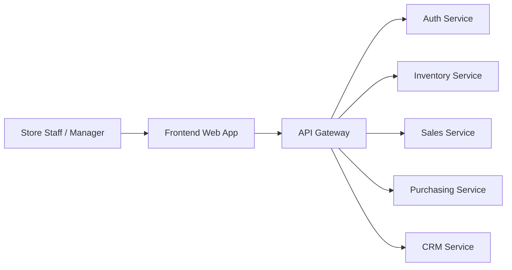
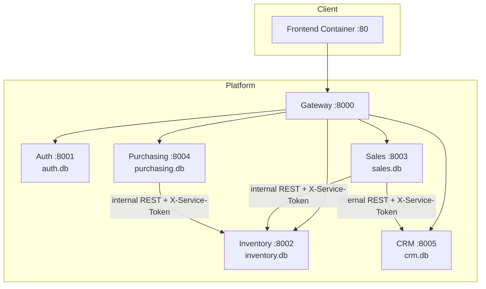
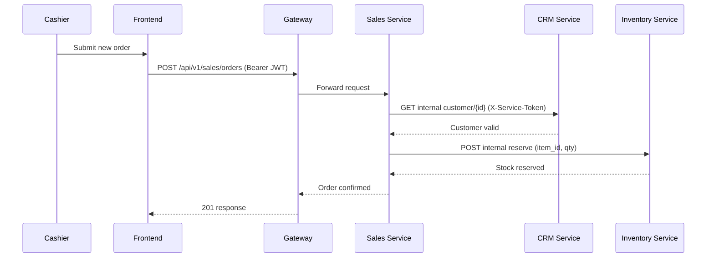
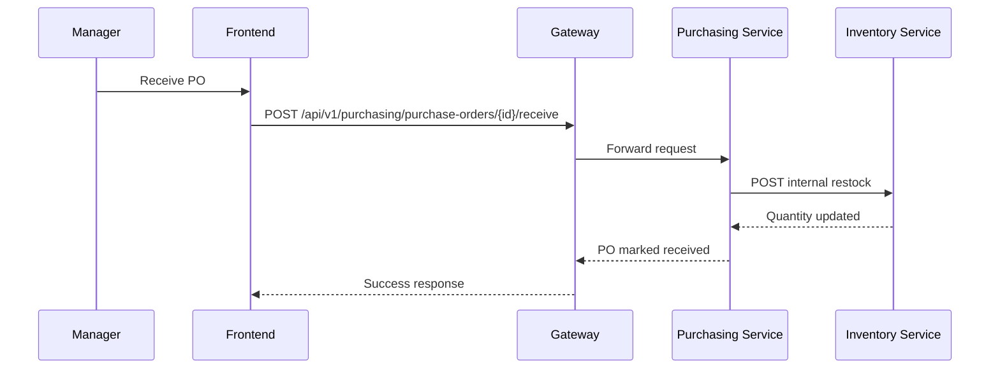

# Architecture Diagrams

## 1. System Context

```mermaid
flowchart LR
    U[Store Staff / Manager] --> FE[Frontend Web App]
    FE --> GW[API Gateway]
    GW --> AUTH[Auth Service]
    GW --> INV[Inventory Service]
    GW --> SALES[Sales Service]
    GW --> PUR[Purchasing Service]
    GW --> CRM[CRM Service]
```

## 2. Container / Service View

```mermaid
flowchart TB
    subgraph Client
      FE[Frontend Container :80]
    end

    subgraph Platform
      GW[Gateway :8000]
      AUTH[Auth :8001\nauth.db]
      INV[Inventory :8002\ninventory.db]
      SALES[Sales :8003\nsales.db]
      PUR[Purchasing :8004\npurchasing.db]
      CRM[CRM :8005\ncrm.db]
    end

    FE --> GW
    GW --> AUTH
    GW --> INV
    GW --> SALES
    GW --> PUR
    GW --> CRM

    SALES -->|internal REST + X-Service-Token| CRM
    SALES -->|internal REST + X-Service-Token| INV
    PUR -->|internal REST + X-Service-Token| INV
```

## 3. Sequence - Create Sales Order

```mermaid
sequenceDiagram
    participant User as Cashier
    participant FE as Frontend
    participant GW as Gateway
    participant SALES as Sales Service
    participant CRM as CRM Service
    participant INV as Inventory Service

    User->>FE: Submit new order
    FE->>GW: POST /api/v1/sales/orders (Bearer JWT)
    GW->>SALES: Forward request
    SALES->>CRM: GET internal customer/{id} (X-Service-Token)
    CRM-->>SALES: Customer valid
    SALES->>INV: POST internal reserve (item_id, qty)
    INV-->>SALES: Stock reserved
    SALES-->>GW: Order confirmed
    GW-->>FE: 201 response
```

## 4. Sequence - Receive Purchase Order

```mermaid
sequenceDiagram
    participant M as Manager
    participant FE as Frontend
    participant GW as Gateway
    participant PUR as Purchasing Service
    participant INV as Inventory Service

    M->>FE: Receive PO #id
    FE->>GW: POST /api/v1/purchasing/purchase-orders/{id}/receive
    GW->>PUR: Forward request
    PUR->>INV: POST internal restock
    INV-->>PUR: Quantity updated
    PUR-->>GW: PO marked received
    GW-->>FE: Success response
```
