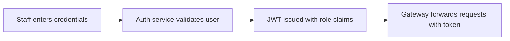
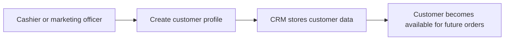
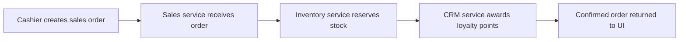
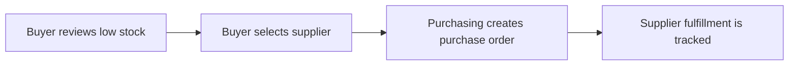
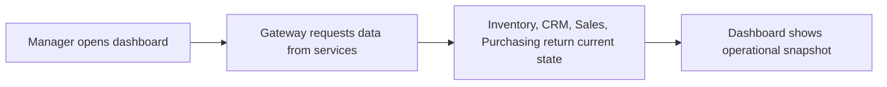

# Business Documentation - Brew Haven ERP

## Company Profile
- **Company Name:** Brew Haven Coffee Group
- **Industry:** Regional coffee shop chain
- **Size:** 35 employees across 3 branches
- **Locations:** Accra Central, East Legon, and Tema
- **Mission Statement:** Deliver fast, consistent coffee experiences while using data-driven operations to reduce waste, improve service, and strengthen customer loyalty.

## Organizational Structure
| Department | Roles | System Interaction |
| --- | --- | --- |
| Executive Management | Admin, Branch Manager | Cross-service oversight, KPI review, approval workflows |
| Sales Operations | Cashier | Captures orders, checks stock availability, updates loyalty |
| Supply Chain | Buyer | Reviews stock levels, manages suppliers, raises purchase orders |
| Marketing & CRM | Marketing Officer | Maintains customer records and loyalty segmentation |
| Warehouse | Inventory Clerk | Monitors item balances and reorder status |

## Core Business Processes
### 1. Authenticate staff access

### 2. Register a customer for loyalty tracking

### 3. Capture a point-of-sale order

### 4. Replenish inventory through procurement

### 5. Monitor operational health

## Pain Points Addressed
1. Branch staff currently track stock in spreadsheets, causing delayed replenishment and stockouts.
2. Customer loyalty data is fragmented and cannot be used during checkout.
3. Purchase orders are not standardized, so supplier communications are inconsistent.
4. Managers lack a single operational dashboard spanning sales, customers, and procurement.
5. There is no role-based access model to prevent unauthorized operational changes.

## User Roles and Permissions
| Capability | Admin | Manager | Cashier | Buyer | Marketing |
| --- | --- | --- | --- | --- | --- |
| Login and access dashboard | ✅ | ✅ | ✅ | ✅ | ✅ |
| View inventory | ✅ | ✅ | ✅ | ✅ | ❌ |
| Create inventory items | ✅ | ✅ | ❌ | ✅ | ❌ |
| Capture sales orders | ✅ | ✅ | ✅ | ❌ | ❌ |
| View sales orders | ✅ | ✅ | ✅ | ❌ | ❌ |
| View and create suppliers | ✅ | ✅ | ❌ | ✅ | ❌ |
| View and create purchase orders | ✅ | ✅ | ❌ | ✅ | ❌ |
| View and create customers | ✅ | ✅ | ✅ | ❌ | ✅ |
| Adjust loyalty points via automated sale flow | ✅ | ✅ | ✅ | ❌ | ❌ |

## Traceability from Business Needs to System Design
- Spreadsheet-driven stock issues map to the **Inventory Service** and low-stock view.
- Slow procurement response maps to the **Purchasing Service** with supplier and purchase-order APIs.
- Loyalty fragmentation maps to the **CRM Service** and the sales-to-CRM integration.
- Branch checkout needs map to the **Sales Service**, lightweight frontend, and JWT-secured cashier role.
- Need for controlled access maps to the **Auth Service**, JWT claims, and route-level authorization.
