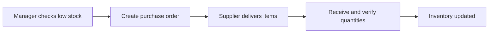
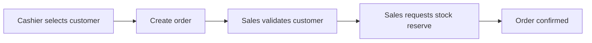
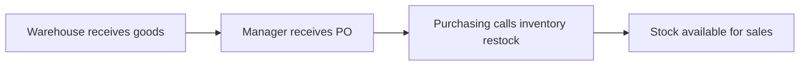

# Business Documentation - ITSAR Coffee Group

## 1. Company Profile

- Company Name: ITSAR Coffee Group
- Industry: Regional food and beverage (coffee retail)
- Size: 65 employees
- Locations: 5 branches in one metro area
- Mission: Deliver consistent coffee quality and fast service using data-driven operations.

## 2. Organizational Structure

- Executive: CEO, Operations Director
- Store Operations: Branch Managers, Cashiers, Baristas
- Procurement: Purchasing Officers
- Warehouse: Inventory Clerks
- Customer Success: CRM Staff
- Finance: Accountant

## 3. Core Business Processes (5)

### Process A: Replenish Inventory

1. Branch manager checks low-stock dashboard.
2. Purchasing officer creates purchase order.
3. Supplier delivers goods.
4. Receiving confirms delivered quantities.
5. Inventory levels update across system.

### Process B: Walk-in Sale

1. Cashier selects customer or guest profile.
2. Cashier creates order for item(s).
3. System verifies stock availability.
4. Stock is reserved/deducted.
5. Order is confirmed and stored.

### Process C: New Customer Enrollment

1. Customer provides contact details.
2. CRM staff creates customer profile.
3. Profile becomes available for sales lookup.
4. Future purchases are linked to customer history.

### Process D: Supplier Management

1. Purchasing team registers supplier.
2. Supplier is associated with procurement transactions.
3. Supplier records are used in reporting and follow-up.

### Process E: Receiving Purchase Order

1. Warehouse receives delivery.
2. Manager marks PO as received.
3. System pushes restock event to inventory service.
4. Updated stock becomes available for sales.

## 4. Operational Pain Points

- Manual stock tracking causes stockouts and over-ordering.
- No integrated view between sales and inventory.
- Customer records are fragmented and underused.
- Slow purchasing cycle due to spreadsheet approvals.
- Lack of traceable process ownership.

## 5. User Roles and Permissions Matrix

| Role | Login | View Inventory | Create Sales Order | Manage CRM | Create PO | Receive PO |
|---|---|---|---|---|---|---|
| Admin | Yes | Yes | Yes | Yes | Yes | Yes |
| Manager | Yes | Yes | Yes | Yes | Yes | Yes |
| Staff | Yes | Yes | Yes | Limited (view only) | No | No |

## 6. Business-to-Technical Traceability

- Pain point: stock mismatch -> Services: `inventory-service`, `sales-service`, `purchasing-service`
- Pain point: customer history unavailable -> Service: `crm-service`
- Pain point: uncontrolled access -> Service: `auth-service`, JWT role checks in all modules
- Pain point: disconnected systems -> API gateway and inter-service APIs
