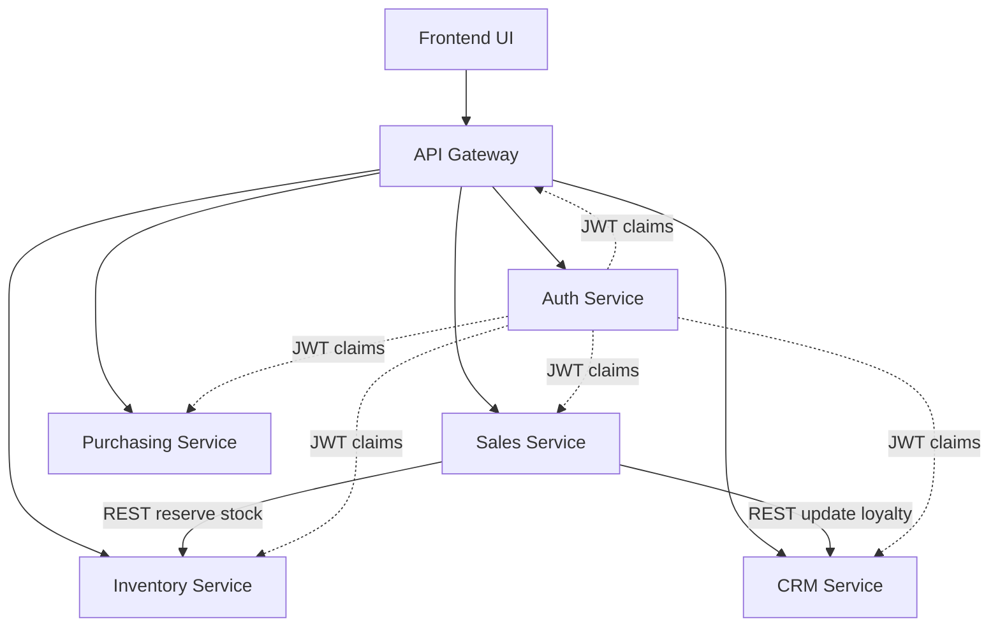

# Technical Documentation - Brew Haven ERP

## Architecture Summary
The solution uses a microservices architecture with five deployable Node.js services:

1. **Auth Service** - issues JWTs for seeded users.
2. **Inventory Service** - owns inventory items and stock reservation.
3. **Sales Service** - owns sales orders and orchestrates order placement.
4. **Purchasing Service** - owns suppliers and purchase orders.
5. **CRM Service** - owns customer and loyalty records.
6. **API Gateway** - single entry point and static frontend host.

Each service persists to its **own LokiJS database file**, satisfying the dedicated-database requirement and avoiding shared persistence.

## Architecture Diagram


## Service Boundaries and Datastores
| Service | Responsibility | Database File |
| --- | --- | --- |
| Auth | Identity and role claims | `services/auth/data/auth.db` |
| Inventory | Stock records and reservation | `services/inventory/data/inventory.db` |
| Sales | Order lifecycle | `services/sales/data/sales.db` |
| Purchasing | Suppliers and purchase orders | `services/purchasing/data/purchasing.db` |
| CRM | Customer profiles and loyalty | `services/crm/data/crm.db` |

## Inter-Service Communication
- **Method:** REST over HTTP inside the Docker Compose network.
- **Flow 1:** `Sales Service -> Inventory Service` to reserve stock before confirming an order.
- **Flow 2:** `Sales Service -> CRM Service` to award loyalty points after a successful order.
- **Justification:** REST keeps the implementation lightweight, transparent, and easy to document for a student capstone while still demonstrating clear service-to-service boundaries.

## Security Model
- Authentication uses **JWT**.
- Role claims are included in the token and enforced at each protected endpoint.
- Internal service calls use a shared `SERVICE_TOKEN` header for service-to-service trust, while public business routes remain JWT-protected.
- The gateway and each service apply **rate limiting** to reduce abuse on public API routes.
- Internal service base URLs are restricted to an allowlisted set of hosts and ports before the sales service can call them.

## Data Models
### User
```json
{
  "id": "usr-manager",
  "username": "manager",
  "role": "manager",
  "fullName": "Musa Manager"
}
```

### Inventory Item
```json
{
  "id": "inv-beans",
  "sku": "INV-001",
  "name": "Arabica Beans",
  "quantity": 40,
  "reorderLevel": 12,
  "unitPrice": 8,
  "supplierId": "sup-beans"
}
```

### Sales Order
```json
{
  "id": "sale-2026",
  "customerId": "crm-aisha",
  "lineItems": [{ "itemId": "inv-beans", "quantity": 2, "unitPrice": 8 }],
  "total": 16,
  "paymentMethod": "card",
  "status": "confirmed"
}
```

### Purchase Order
```json
{
  "id": "po-2026",
  "supplierId": "sup-beans",
  "itemName": "Arabica Beans",
  "quantity": 15,
  "status": "requested"
}
```

### Customer
```json
{
  "id": "crm-aisha",
  "name": "Aisha Bello",
  "email": "aisha@example.com",
  "loyaltyPoints": 18,
  "segment": "Gold"
}
```

## API Specification
The repository includes an OpenAPI document at [`docs/openapi.yaml`](./openapi.yaml) covering the core gateway-exposed endpoints for authentication, inventory, sales, purchasing, and CRM.

## Technology Choices
| Decision | Choice | Rationale |
| --- | --- | --- |
| Runtime | Node.js + Express | Fastest path to a compact, readable microservices baseline |
| Persistence | LokiJS per service | File-backed embedded database avoids shared storage while keeping setup simple |
| Gateway | Express proxy gateway | Clear single entry point with minimal operational overhead |
| Frontend | Static HTML/CSS/JS | Demonstrates the main flows without introducing heavy frontend tooling |
| Orchestration | Docker Compose | Meets the deployment requirement with low setup cost |

## Logging and Operational Notes
- Every service exposes `/health`.
- Startup logs identify the listening port for each service.
- The frontend logs user activity and API outcomes in-browser for demo purposes.
